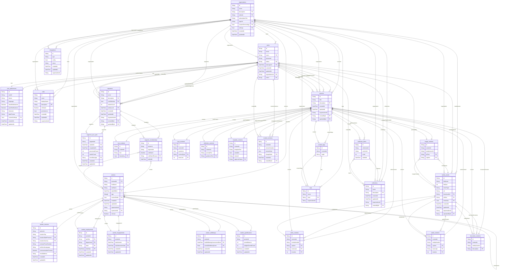

# Database ER Diagram

> Automatically generated from Prisma schema at 5/5/2025, 10:41:40 PM

```mermaid
erDiagram
    organizations {
        String id
        String name
        String description PK
        String website PK
        String subscriptionTier
        String logoUrl PK
        Json customTerminology PK
        Json settings PK
        DateTime createdAt
        DateTime updatedAt
    }
    users {
        String id
        String email
        String name PK
        String password
        String status PK
        DateTime lastLoginAt PK
        DateTime createdAt
        DateTime updatedAt
        String organizationId PK
        String roleId PK
    }
    user_preferences {
        String id
        String userId
        String theme
        String language
        Boolean emailNotifications
        Boolean pushNotifications
        String timezone
        String dateFormat
        Json customSettings PK
        DateTime createdAt
        DateTime updatedAt
    }
    roles {
        String id
        String name
        String displayName
        String description PK
        Boolean isDefault
        Json permissions
        DateTime createdAt
        DateTime updatedAt
        String organizationId
    }
    integrations {
        String id
        String type
        Json config
        String status
        DateTime createdAt
        DateTime updatedAt
        String organizationId
    }
    workers {
        String id
        String externalId PK
        String firstName
        String lastName
        DateTime dateOfBirth PK
        String[] tags
        Json customFields PK
        DateTime createdAt
        DateTime updatedAt
        String organizationId
        String supervisorId PK
        Boolean isActive
    }
    worker_contacts {
        String id
        String workerId
        String locationCity PK
        String locationStateProvince PK
        String locationCountry PK
        String primaryPhoneNumber
        String preferredLanguage
        Boolean communicationConsent
        String emailAddress PK
        DateTime createdAt
        DateTime updatedAt
    }
    worker_employments {
        String id
        String workerId
        String jobTitle PK
        String department PK
        String team PK
        DateTime hireDate PK
        DateTime createdAt
        DateTime updatedAt
    }
    worker_engagements {
        String id
        String workerId
        DateTime lastActiveAt PK
        DateTime lastInteractionDate PK
        DateTime createdAt
        DateTime updatedAt
    }
    worker_wellbeings {
        String id
        String workerId
        DateTime lastWellbeingAssessmentDate PK
        Float overallWellbeingScore PK
        DateTime createdAt
        DateTime updatedAt
    }
    worker_gamifications {
        String id
        String workerId
        Int pointsBalance
        Int badgesEarnedCount
        DateTime createdAt
        DateTime updatedAt
    }
    segments {
        String id
        String name
        String description PK
        Json ruleDefinition PK
        Int workerCount
        DateTime lastSyncAt PK
        DateTime createdAt
        DateTime updatedAt
        String organizationId
        String createdById PK
        String updatedById PK
    }
    segment_memberships {
        String id
        String workerId
        String segmentId
        Boolean ruleMatch
        String ruleMatchReason PK
        DateTime addedAt
    }
    segment_sync_jobs {
        String id
        String segmentId
        DateTime startedAt PK
        DateTime completedAt PK
        Int processedCount
        Int matchCount
        String errorMessage PK
        DateTime createdAt
        DateTime updatedAt
    }
    contents {
        String id
        String title
        String description PK
        DateTime createdAt
        DateTime updatedAt
        String organizationId
        String createdById PK
        String updatedById PK
    }
    text_contents {
        String id
        String contentId
        String text
        Json formatting PK
    }
    image_contents {
        String id
        String contentId
        String mediaAssetId
        String altText PK
        String caption PK
    }
    video_contents {
        String id
        String contentId
        String mediaAssetId
        String caption PK
        String transcript PK
        Int duration PK
    }
    audio_contents {
        String id
        String contentId
        String mediaAssetId
        String caption PK
        String transcript PK
        Int duration PK
    }
    document_contents {
        String id
        String contentId
        String mediaAssetId
        String description PK
    }
    quiz_contents {
        String id
        String contentId
        Json questions
        String scoringType PK
        Int timeLimit PK
    }
    reflection_contents {
        String id
        String contentId
        String promptText
        String guidanceText PK
    }
    template_contents {
        String id
        String contentId
        String templateText
        Json variables
        String channel
        String approvalStatus PK
    }
    media_assets {
        String id
        String fileName
        Int fileSize
        String mimeType
        String url
        String thumbnailUrl PK
        String altText PK
        Json metadata PK
        DateTime createdAt
        DateTime updatedAt
        String organizationId
        String uploadedById PK
    }
    content_versions {
        String id
        String contentId
        Int versionNumber
        Json versionData
        String changeNote PK
        DateTime createdAt
        String createdById PK
    }
    tags {
        String id
        String name
        String color PK
        String organizationId
    }
    content_tags {
        String id
        String contentId
        String tagId
    }
    collections {
        String id
        String name
        String description PK
        DateTime createdAt
        DateTime updatedAt
        String organizationId
        String createdById PK
    }
    collection_items {
        String id
        String collectionId
        String contentId
        Int order
        DateTime addedAt
    }
    organizations ||--o{ users : "users"
    organizations ||--o{ roles : "roles"
    organizations ||--o{ integrations : "integrations"
    organizations ||--o{ workers : "workers"
    organizations ||--o{ segments : "segments"
    organizations ||--o{ contents : "contents"
    organizations ||--o{ media_assets : "mediaAssets"
    organizations ||--o{ tags : "tags"
    organizations ||--o{ collections : "collections"
    users }o--|| organizations : "organization"
    users }o--|| roles : "role"
    users ||--|| user_preferences : "preferences"
    users ||--o{ segments : "createdSegments"
    users ||--o{ segments : "updatedSegments"
    users ||--o{ contents : "createdContents"
    users ||--o{ contents : "updatedContents"
    users ||--o{ media_assets : "mediaUploads"
    users ||--o{ content_versions : "contentVersions"
    users ||--o{ collections : "collections"
    user_preferences ||--|| users : "user"
    roles }o--|| organizations : "organization"
    roles ||--o{ users : "users"
    integrations }o--|| organizations : "organization"
    workers }o--|| organizations : "organization"
    workers ||--|| worker_contacts : "contact"
    workers ||--|| worker_employments : "employment"
    workers ||--|| worker_engagements : "engagement"
    workers ||--|| worker_wellbeings : "wellbeing"
    workers ||--|| worker_gamifications : "gamification"
    workers ||--|| workers : "supervisor"
    workers ||--o{ workers : "supervisees"
    workers ||--o{ segment_memberships : "segmentMemberships"
    worker_contacts ||--|| workers : "worker"
    worker_employments ||--|| workers : "worker"
    worker_engagements ||--|| workers : "worker"
    worker_wellbeings ||--|| workers : "worker"
    worker_gamifications ||--|| workers : "worker"
    segments }o--|| organizations : "organization"
    segments }o--|| users : "createdBy"
    segments }o--|| users : "updatedBy"
    segments ||--o{ segment_memberships : "members"
    segments ||--o{ segment_sync_jobs : "syncJobs"
    segment_memberships }o--|| workers : "worker"
    segment_memberships }o--|| segments : "segment"
    segment_sync_jobs }o--|| segments : "segment"
    contents }o--|| organizations : "organization"
    contents }o--|| users : "createdBy"
    contents }o--|| users : "updatedBy"
    contents ||--o{ content_versions : "versions"
    contents ||--|| text_contents : "textContent"
    contents ||--|| image_contents : "imageContent"
    contents ||--|| video_contents : "videoContent"
    contents ||--|| audio_contents : "audioContent"
    contents ||--|| document_contents : "documentContent"
    contents ||--|| quiz_contents : "quizContent"
    contents ||--|| reflection_contents : "reflectionContent"
    contents ||--|| template_contents : "templateContent"
    contents ||--o{ content_tags : "contentTags"
    contents ||--o{ collection_items : "collectionItems"
    text_contents ||--|| contents : "content"
    image_contents ||--|| contents : "content"
    image_contents }o--|| media_assets : "mediaAsset"
    video_contents ||--|| contents : "content"
    video_contents }o--|| media_assets : "mediaAsset"
    audio_contents ||--|| contents : "content"
    audio_contents }o--|| media_assets : "mediaAsset"
    document_contents ||--|| contents : "content"
    document_contents }o--|| media_assets : "mediaAsset"
    quiz_contents ||--|| contents : "content"
    reflection_contents ||--|| contents : "content"
    template_contents ||--|| contents : "content"
    media_assets }o--|| organizations : "organization"
    media_assets }o--|| users : "uploadedBy"
    media_assets ||--o{ image_contents : "imageContents"
    media_assets ||--o{ video_contents : "videoContents"
    media_assets ||--o{ audio_contents : "audioContents"
    media_assets ||--o{ document_contents : "documentContents"
    content_versions }o--|| contents : "content"
    content_versions }o--|| users : "createdBy"
    tags }o--|| organizations : "organization"
    tags ||--o{ content_tags : "contentTags"
    content_tags }o--|| contents : "content"
    content_tags }o--|| tags : "tag"
    collections }o--|| organizations : "organization"
    collections }o--|| users : "createdBy"
    collections ||--o{ collection_items : "items"
    collection_items }o--|| collections : "collection"
    collection_items }o--|| contents : "content"
```
